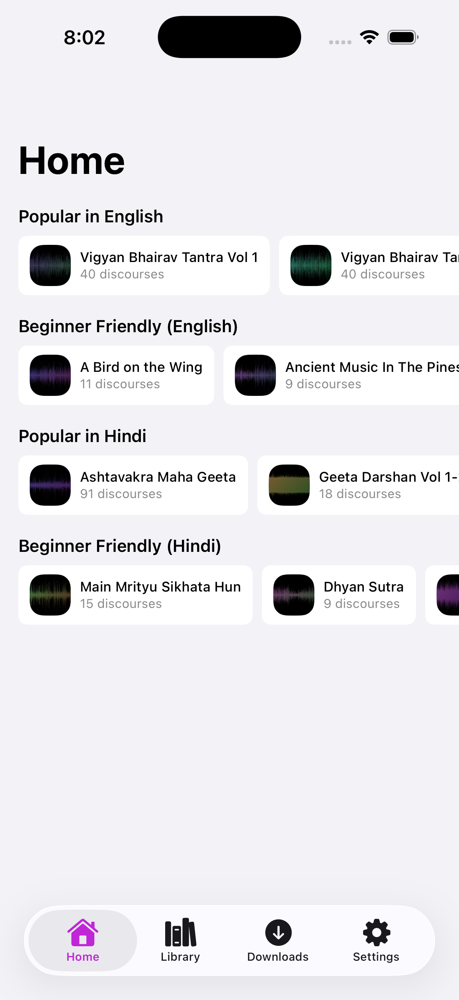

# Osho Talks

<p align="center">
  
</p>

<p align="center">
  A focused iPhone app for browsing, downloading, and listening to Osho's audio discourses.
</p>

<p align="center">
  <a href="https://apps.apple.com/us/app/osho-talks-audio-discourses/id6774409039"><strong>Download free on the App Store</strong></a>
  &nbsp;|&nbsp;
  <a href="PRIVACY.md">Privacy policy</a>
</p>

## Why this app exists

Many audio apps include social feeds, subscriptions, accounts, and other features that get in the way of listening. Osho Talks was built as a simpler alternative: a focused audio player with a complete listening toolkit and nothing unrelated.

There are no ads, accounts, subscriptions, or tracking.

## Screenshot

<p align="center">
  
</p>

## Features

- Browse and search 4,361 discourses across 261 English and Hindi series
- Download talks for offline listening, including background downloads
- Continue from the exact position where you stopped
- Listen in the background with Lock Screen, Control Center, AirPods, and AirPlay controls
- Change playback speed from 0.5x to 2x and use voice boost
- Reduce recording noise with the optional RNNoise filter, currently in beta
- Save timestamped bookmarks with notes and categories
- Use a countdown sleep timer or stop at the end of the current discourse
- Automatically download the next talk and delete completed talks when enabled
- Review listening history, daily totals, and streaks
- Sync progress, bookmarks, and listening stats through your own iCloud account
- Choose light, dark, or system appearance and customize the accent color

## Privacy

Osho Talks has no developer-operated server and includes no analytics or advertising SDKs. Settings and downloaded audio stay on the device. Playback progress, bookmarks, and listening stats can sync between devices through the listener's own iCloud account.

See [PRIVACY.md](PRIVACY.md) for details.

## Requirements

- iPhone or iPad running iOS 18 or later
- Xcode with an iOS 18 or later SDK for local builds
- [XcodeGen](https://github.com/yonaskolb/XcodeGen)

## Build locally

```bash
git clone https://github.com/aagrawal207/OshoDiscourses.git
cd OshoDiscourses
brew install xcodegen
xcodegen generate
xcodebuild -project OshoDiscourses.xcodeproj \
  -scheme OshoDiscourses \
  -destination 'platform=iOS Simulator,name=iPhone 17 Pro' \
  build
```

The app is written in Swift 6 and SwiftUI. It uses Apple frameworks for playback, downloads, media controls, and iCloud sync. There are no package-manager dependencies. RNNoise is vendored in the repository for optional noise reduction.

## Audio and affiliation

The app does not bundle discourse audio. It accesses publicly available recordings from [oshoworld.com](https://www.oshoworld.com/) and an [Internet Archive](https://archive.org/) mirror.

All discourses are copyright OSHO International Foundation. Osho Talks is an independent app and is not affiliated with or endorsed by the Osho International Foundation.

## Feedback

Report bugs or missing discourses through [GitHub Issues](https://github.com/aagrawal207/OshoDiscourses/issues).

## License

Original source code in this project is available under the [MIT License](LICENSE). Vendored RNNoise code remains under its [BSD license](OshoDiscourses/RNNoise/COPYING). Osho audio, names, imagery, and other third-party content are not covered by the MIT License.
