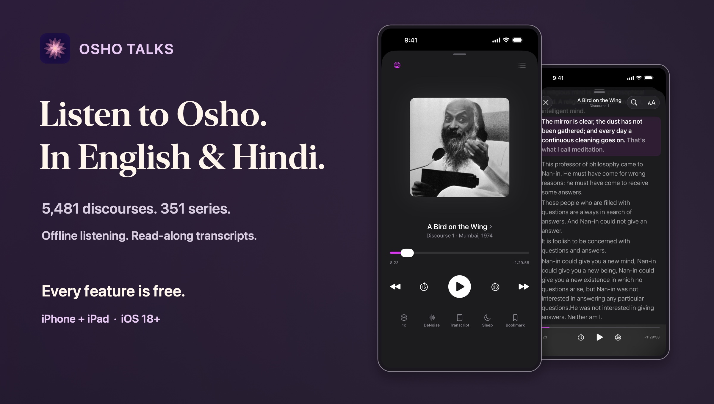
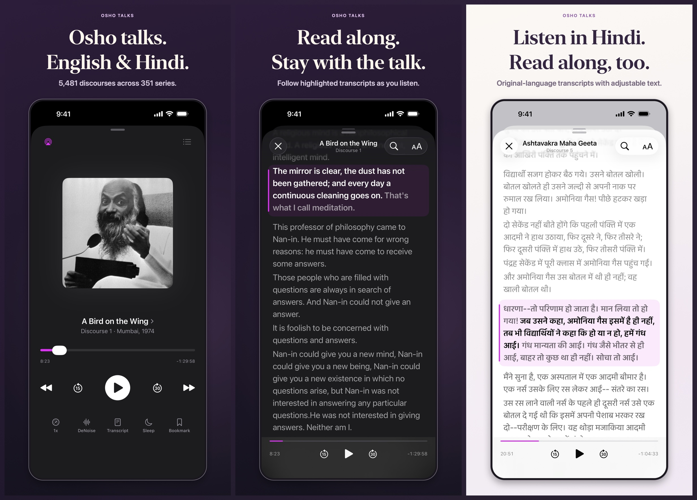
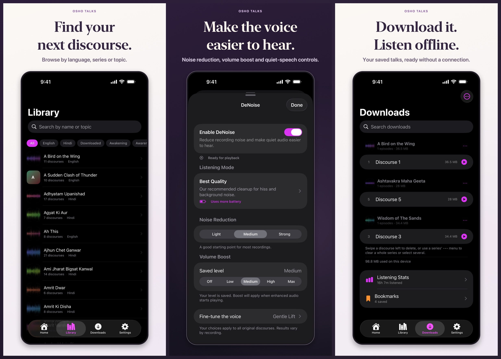
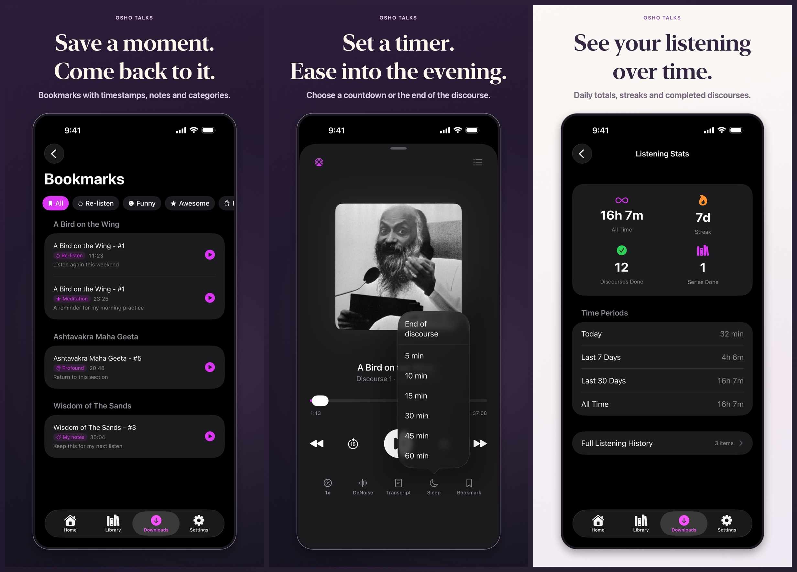

# Osho Talks

<p align="center">
  <a href="https://apps.apple.com/us/app/osho-talks-audio-discourses/id6774409039">
    
  </a>
</p>

<p align="center">
  <a href="https://apps.apple.com/us/app/osho-talks-audio-discourses/id6774409039">
    
  </a>
</p>

<p align="center">
  <strong>Free for iPhone and iPad</strong> · English &amp; Hindi · iOS 18+
  <br>
  No ads. No app account. No subscriptions.
</p>

Explore **5,481 Osho discourses across 351 series**, from Zen and Tantra to Tao
and the Upanishads. Download a talk for a walk or a quiet evening, follow its
transcript, and continue from your saved position next time.

<p align="center">
  <a href="#read-as-you-listen">Read along</a> ·
  <a href="#a-library-for-everyday-listening">Explore &amp; download</a> ·
  <a href="#keep-your-place-and-your-notes">Bookmarks &amp; stats</a> ·
  <a href="SUPPORT.md">Support</a>
</p>

<sub>The player and DeNoise screenshots preview the upcoming update. Screens show
the real app with demonstration listening history.</sub>

## Read as you listen

Open a transcript beside the player and follow the highlighted text. Original-language
transcripts are available for **4,946 discourses in English and Hindi**.
Search for a passage, change the text size, or tap a sentence to play from that point.

<p align="center">
  
</p>

The reader remembers your place. If a recording's timing drifts, **Audio is here**
lets you line the text up with what you hear.

## A library for everyday listening

Find a series by name or topic, filter by language, or start with the **Popular**
and **Beginner Friendly** collections. Keep a few talks downloaded so your next
listen is ready without a connection.

<p align="center">
  
</p>

- **Tune older recordings.** DeNoise brings noise reduction, volume boost and
  quiet-speech controls together. Choose Best Quality, Balanced or Gentle Cleanup,
  and compare with the original sound. Results vary by recording.
- **Download in the background.** Downloads continue when you switch apps or
  lock the screen. Manage talks by series and see how much storage they use.
- **Plan the next listen.** Optional Smart Download prepares the next discourse;
  Smart Delete can clear finished recordings.

## Keep your place and your notes

Save a timestamped bookmark with a note and category, then return directly to that
moment. Listening stats show your daily totals, streak and completed discourses.
For an evening listen, set a countdown or stop at the end of the talk.

<p align="center">
  
</p>

### More ways to make listening comfortable

| Feature | What it does |
| --- | --- |
| Continue Listening | Saves your position in each discourse and links you back to its series |
| Background playback | Keeps audio playing with the screen locked, with Lock Screen, Control Center and AirPods controls |
| Playback speed | Choose a pace from 0.5× to 2×, with quick back and forward controls |
| AirPlay | Listen through a compatible speaker or other AirPlay device |
| iCloud sync | Carries progress, bookmarks, listening stats and transcript reading state between your devices |
| Appearance | Light, dark or system appearance, with eight accent colors |
| Files access | Find downloaded recordings in the iOS Files app |

## Free to listen. Personal by design.

Every feature and discourse is available without a purchase. The upcoming
**Support Development** tip jar offers optional, one-time tips that unlock nothing.

Osho Talks has no developer-operated server and includes no analytics or advertising
SDKs. Downloads and cached transcripts stay on your device. Synced listening data
uses your own iCloud account. Read the [privacy policy](PRIVACY.md).

<p align="center">
  <a href="https://apps.apple.com/us/app/osho-talks-audio-discourses/id6774409039"><strong>Download Osho Talks free on the App Store</strong></a>
  <br>
  iPhone and iPad · iOS 18 or later
</p>

## Questions or feedback?

See [Support](SUPPORT.md) for help with the app, missing discourses or purchases.
You can also [report a problem on GitHub](https://github.com/aagrawal207/OshoDiscourses/issues).

## For developers

<details>
<summary>Build from source</summary>

The app uses Swift 6 and SwiftUI, with Apple frameworks for playback, downloads,
media controls and iCloud sync. Noise reduction uses vendored RNNoise C sources
and DeepFilterNet 3 through a Rust/tract bridge. The iOS app has no package-manager
dependencies; normal app builds need no Rust toolchain.

Requirements: Xcode with an iOS 26.4 or later SDK and
[XcodeGen](https://github.com/yonaskolb/XcodeGen). The app runs on iOS 18+.

```bash
git clone https://github.com/aagrawal207/OshoDiscourses.git
cd OshoDiscourses
brew install xcodegen
xcodegen generate
xcodebuild -project OshoDiscourses.xcodeproj \
  -scheme OshoDiscourses \
  -destination 'generic/platform=iOS Simulator' \
  build
```

Open the generated Xcode project to run on a simulator or your device.
The [project guide](CLAUDE.md) covers architecture and development workflows.
[Screenshot tools](Tools/StoreAssets/README.md) document how the gallery was made.

</details>

## Audio and affiliation

The app does not bundle discourse audio or transcripts. It accesses publicly
available recordings from [oshoworld.com](https://www.oshoworld.com/) and an
[Internet Archive](https://archive.org/) mirror, with transcripts from the matching
oshoworld.com pages.

All discourses are copyright OSHO International Foundation. Osho Talks is an
independent app and is not affiliated with or endorsed by the Osho International Foundation.

## License

Original source code in this project is available under the [MIT License](LICENSE). Vendored RNNoise code remains under its [BSD license](OshoDiscourses/RNNoise/COPYING), and DeepFilterNet retains its [MIT/Apache-2.0 licenses](native/deepfilter-bridge/third-party-licenses/DeepFilterNet/). Osho audio, names, imagery, and other third-party content are not covered by the MIT License.
