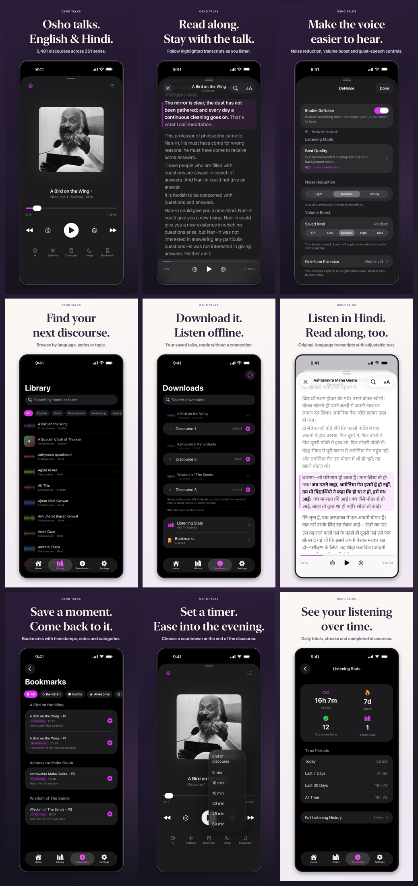
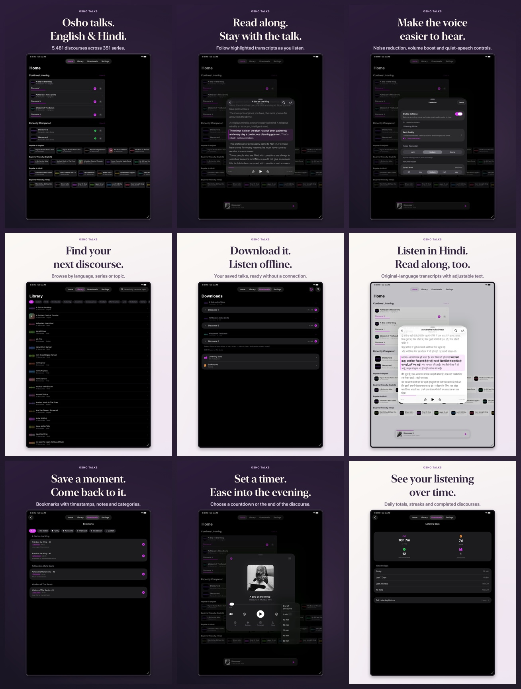

# 1.16.0 screenshot refresh

**Prepared for upload after 1.15.0 releases.** App Store Connect rejected creation
of 1.16.0 while 1.15.0 was `WAITING_FOR_REVIEW`. The selected workflow keeps that
review queued. These images have not been uploaded to App Store Connect.

## Gallery

| Set | Images | Dimensions | CLI display type |
| --- | ---: | --- | --- |
| [iPhone](iphone/) | 9 | 1320 × 2868 | `IPHONE_69` |
| [iPad](ipad/) | 9 | 2064 × 2752 | `IPAD_PRO_3GEN_129` |



<details>
<summary>iPad gallery</summary>



</details>

The order is: listening, English read-along, DeNoise, catalog browsing, offline
downloads, Hindi read-along, bookmarks, sleep timer and listening stats. The first
iPad image shows Home; the first iPhone image shows the full player.

## Source and validation

- Captured from **1.15.0 (26)** on iPhone 17 Pro Max and iPad Pro 13-inch (M4),
  both running iOS 26.5. The proposed 1.16.0 work is a listing refresh.
- Raw app captures and capture metadata are retained in [raw/](raw/).
- Dedicated, signed-out simulators contain three real downloaded recordings and
  demonstration bookmarks, completion history and daily totals. These are not a
  real listener's history. Audio files are excluded from the repository.
- iPad captures preserve the native tablet layout, including form-sheet controls.
- Portrait PNGs are opaque sRGB. The renderer checks text bounds and records file
  sizes, SHA-256 and MD5 in [manifest.json](manifest.json).
- `asc screenshots validate` passed all **18 images**, with zero errors or warnings.
- GitHub uses a hero and three JPEG gallery strips generated from these captures.

[Apple's screenshot specifications](https://developer.apple.com/help/app-store-connect/reference/app-information/screenshot-specifications/)
allow the largest iPhone and iPad sets to supply smaller sizes. The installed CLI
maps `IPHONE_69` to the API's `APP_IPHONE_67` set identifier. On the new 1.16.0
localization, older optional 6.1-inch and 6.5-inch images must be cleared after the
new largest set completes, so they do not take precedence over the refreshed art.

## Prepare the App Store listing

From the repository root:

```bash
python3 Tools/StoreAssets/prepare.py
```

This validates local metadata and image checksums, reads the live version state,
and prints a plan. After 1.15.0 has released:

```bash
python3 Tools/StoreAssets/prepare.py --apply
```

The apply path creates or updates the editable 1.16.0 listing, applies its prepared
metadata, uploads the two image sets and checks delivery state, order and checksums.
It refuses to proceed while 1.15.0 is queued, or if source and target unexpectedly
share screenshot resources. App binary preparation and submission are separate
release steps. The live upload path remains unexercised until the version can be created.

See [capture/render tools](../../../../Tools/StoreAssets/README.md) and the
[1.16.0 release draft](../../releases/1.16.0.md).
