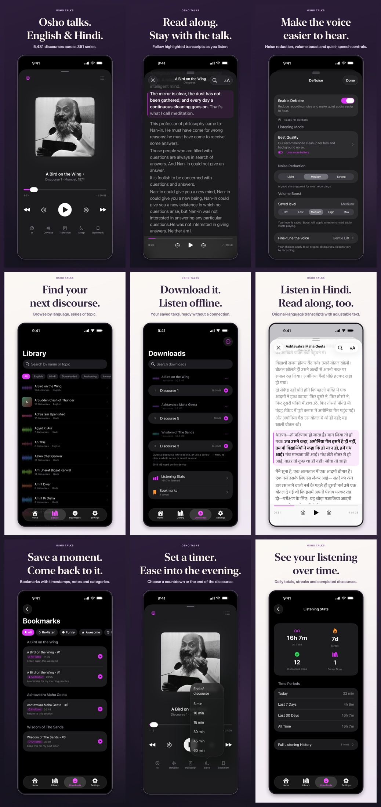
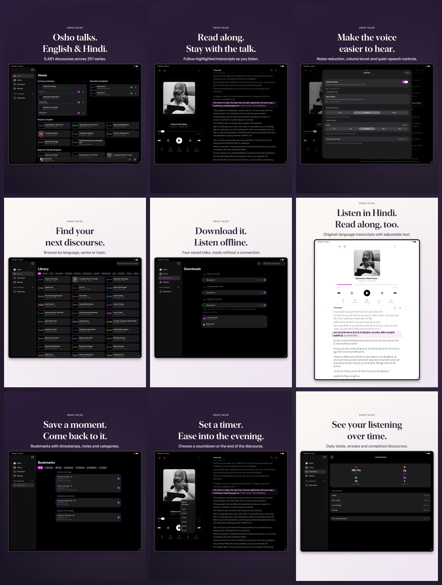

# 1.16.0 screenshot refresh

**Uploaded to the 1.16.0 App Store Connect draft.** On 2026-09-19, all 18 images
reached `COMPLETE`, with order and MD5 checksums matching the local manifest.
The version remains `PREPARE_FOR_SUBMISSION` at the user's request, with no build
attached. [Upload identifiers](upload-receipt.json) record the destination resources.

These images come from **1.15.0 (26)** and predate the 1.16.0 (28) platform work.
Before submission, new captures are needed for:

- **iPad:** the sidebar and the two-column player with the transcript beside it.
  The current iPad set shows the earlier single-column layout.
- **Mac:** a new Mac screenshot set, once the macOS platform is added to the app record.
- **Apple Watch:** a new Watch set, such as the player, the iPhone library pages and
  Saved Talks.

CarPlay needs no App Store screenshots. See the [release record](../../releases/1.16.0.md).

## Gallery

| Set | Images | Dimensions | CLI display type |
| --- | ---: | --- | --- |
| [iPhone](iphone/) | 9 | 1320 × 2868 | `IPHONE_69` |
| [iPad](ipad/) | 9 | 2064 × 2752 | `IPAD_PRO_3GEN_129` |



<details>
<summary>iPad gallery</summary>



</details>

The order is: listening, English read-along, DeNoise, catalog browsing, offline
downloads, Hindi read-along, bookmarks, sleep timer and listening stats. The first
iPad image shows Home; the first iPhone image shows the full player.

## Source and validation

- Captured from **1.15.0 (26)** on iPhone 17 Pro Max and iPad Pro 13-inch (M4),
  both running iOS 26.5, for the initial listing-refresh pass.
- Raw app captures and capture metadata are retained in [raw/](raw/).
- Dedicated, signed-out simulators contain three real downloaded recordings and
  demonstration bookmarks, completion history and daily totals. These are not a
  real listener's history. Audio files are excluded from the repository.
- iPad captures preserve the native tablet layout, including form-sheet controls.
- Portrait PNGs are opaque sRGB. The renderer checks text bounds and records file
  sizes, SHA-256 and MD5 in [manifest.json](manifest.json).
- `asc screenshots validate` passed all **18 images**, with zero errors or warnings.
- Remote readback confirmed two populated sets of nine images, all `COMPLETE`.
- GitHub uses a hero and three JPEG gallery strips generated from these captures.

[Apple's screenshot specifications](https://developer.apple.com/help/app-store-connect/reference/app-information/screenshot-specifications/)
allow the largest iPhone and iPad sets to supply smaller sizes. The installed CLI
maps `IPHONE_69` to the API's `APP_IPHONE_67` set identifier. The older optional
6.1-inch and 6.5-inch images were cleared from 1.16.0 after the new largest set
completed. Their empty set containers were also removed to clear validation errors.

## Recheck or update the App Store draft

From the repository root:

```bash
python3 Tools/StoreAssets/prepare.py
```

This validates local metadata and image checksums, reads the live version state,
and prints a plan. To apply changes to the existing draft:

```bash
python3 Tools/StoreAssets/prepare.py --apply --app-info 59482fd4-cdf1-4ecf-a4ac-ec035e9c41e8
```

The apply path creates or updates the editable 1.16.0 listing, applies its prepared
metadata, uploads the two image sets and checks delivery state, order and checksums.
It refuses to proceed while 1.15.0 is queued, or if source and target unexpectedly
share screenshot resources. The live path has completed for 1.16.0. App binary
preparation and submission remain separate release steps.

See [capture/render tools](../../../../Tools/StoreAssets/README.md) and the
[1.16.0 release draft](../../releases/1.16.0.md).
