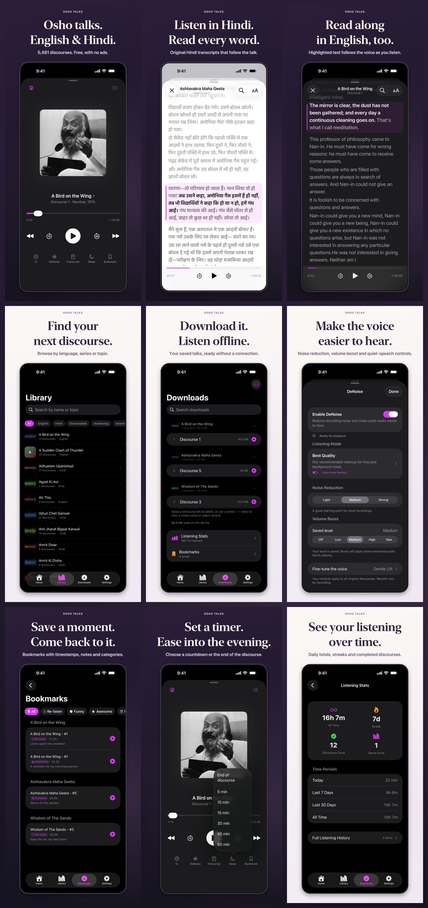
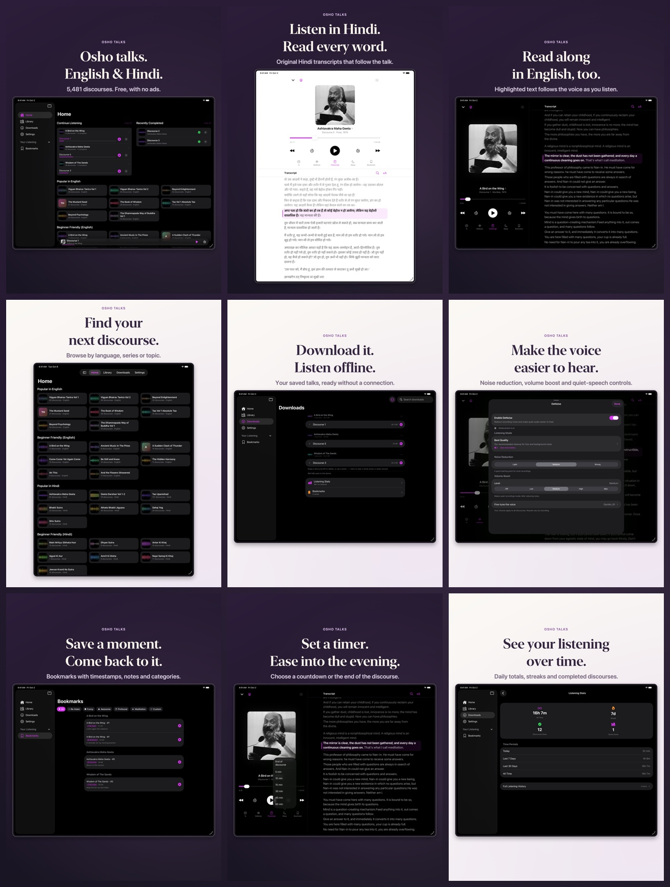

# 1.16.1 screenshots

Re-rendered from the 1.16.0 raw captures plus one new iPad capture, with the order and
captions in [`story.json`](../../../../Tools/StoreAssets/story.json). Uploaded to the 1.16.1
draft on 2026-10-06; all 23 images are `COMPLETE` and match `manifest.json`.



<details>
<summary>iPad gallery</summary>



</details>

| Set | Images | Source builds |
| --- | ---: | --- |
| iPhone | 9 | 1.15.0 (26) |
| iPad | 9 | 1.16.0 (28); `04-explore` from 1.16.1 (29) |
| Apple Watch | 5 | 1.16.0 (28), unchanged |

`raw/ipad/home-popular.png` is a fresh install's Home on `Osho Store iPad` (iPad Pro
13-inch M4, iOS 26.5), dark appearance, no listening history. The screens shown did not
change between the source builds, so the renderer ran with `--allow-mixed-builds`:

```bash
swift Tools/StoreAssets/render.swift 1.16.1 --allow-mixed-builds
```
